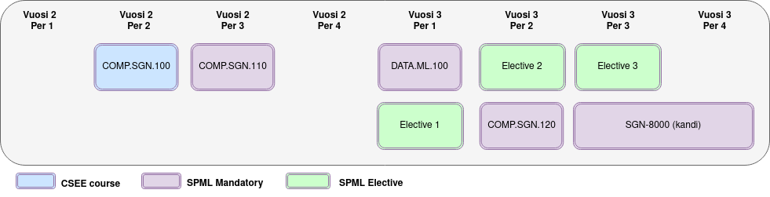
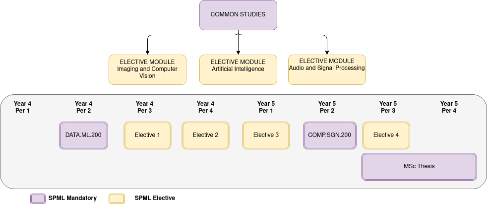

# Computing Sciences Curricula
The BSc and MSc degrees offered by Computing Sciences consist of 1) mandatory courses for everyone and 2) major module and 3) minor module(s). Below are details of each degree program offered by Computing Sciences.

Below are links to relevant information in TAU Web pages:

 - [Search all courses, modules and programs of Tampere University](https://www.tuni.fi/studentsguide/curriculum/course-units) (**Note:** language setting affects the search results)

## Signal Processing and Machine Learning BSc in Technology (Finnish program, 30 cr + thesis)

The Signal Processing and Machine Learning (SPML) major is offered in the Bachelor of Science and Technology degree program of the [Computing and Electrical Engineering](https://www.tuni.fi/en/study-with-us/science-and-engineering-computing-and-electrical-engineering). Our graduates are some of the most wanted in Finnish IT and EE companies and research institutions. The SPML major consists of three mandatory courses (tot 15 cr) and 15 cr from elective courses that can be selected from the list of suggested courses or by proposing a personal study plan.

## Signal Processing and Machine Learning MSc in Technology (Finnish program, 30 cr + thesis)
Similar to our BSc program the MSc program also consists of two mandatory courses (10 cr) and then the student is encouraged to pick one of our three special sub-modules focusing on *Audio*, *Vision* or *Artificial Intelligence*. Since some of these sub-modules contain one shared course that course is moved to elective module.

